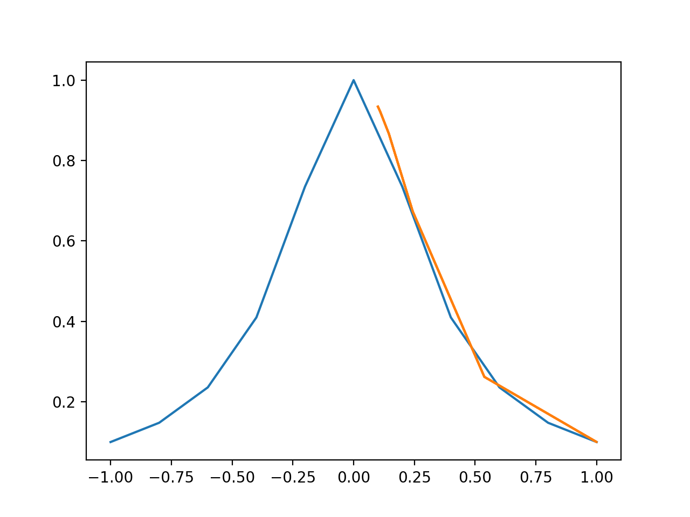
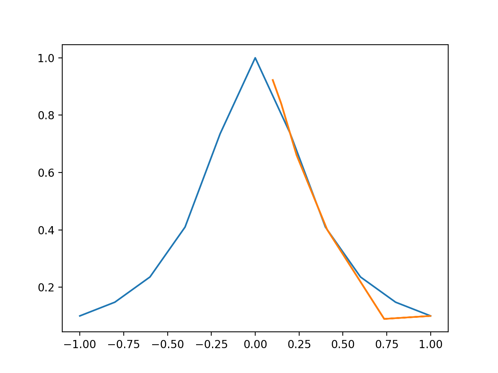
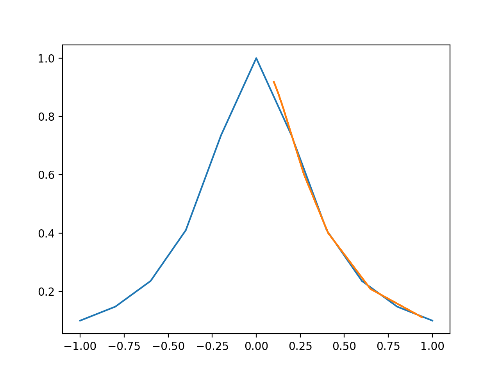
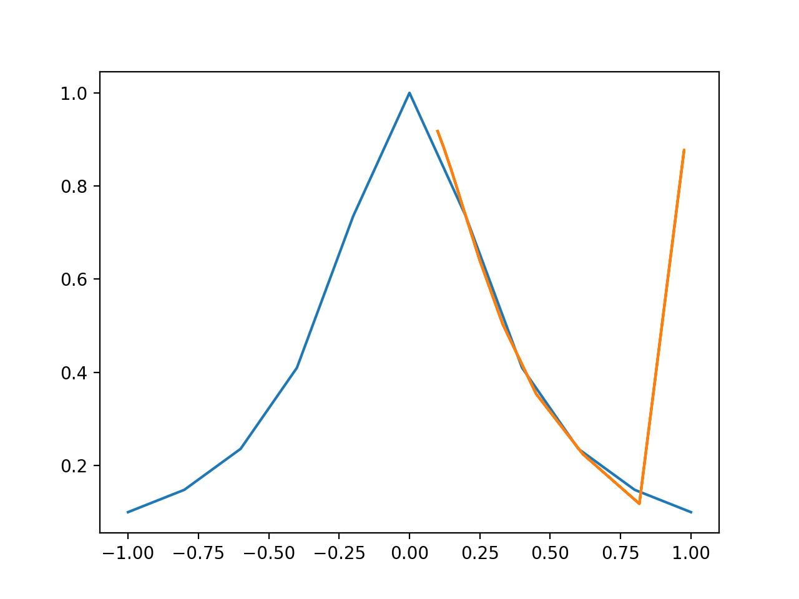
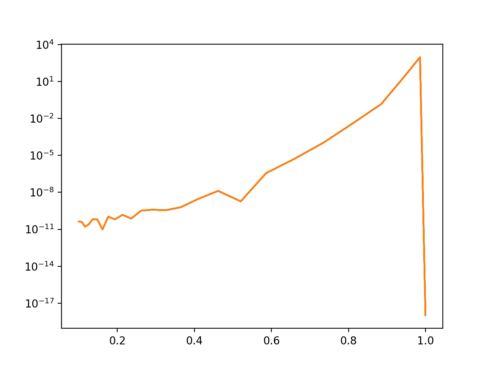
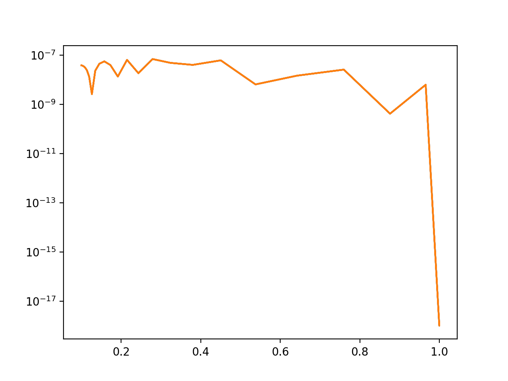
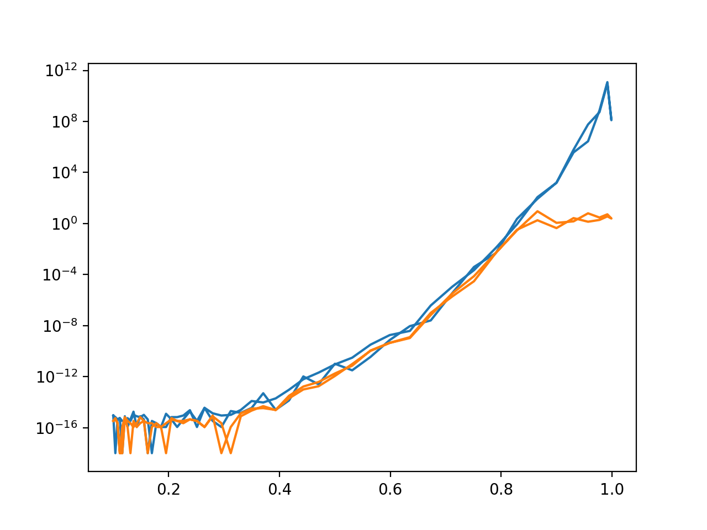

The programs were written in Python.

**Algorithms & Descriptions**

Our problem for this assignment was straightforward; we wished to interpolate polynomials through computer programs. The interpolation methods are well-known: the first is Lagrange Interpolation, and the second is Barycentric Interpolation. The inputs for our interpolation algorithms, ``xin`` and ``xout``, were generated through ``numpy.linspace``. There are 2 types of ``xin``s: the first is ``xinU``, or uniform vectors, and ``xinC``, or Chebyshev vectors. Each type of linspace was generated twice, for a total of 8 linspaces. ``xouts`` are simply the function $f(x)$ evaluated at each point of each ``xin``s.

The first interpolation method, or Lagrange Interpolation, was broken up into 3 parts. The first is ``interpolate1(xin, xout)``, which is a ``for`` loop that iterates through each element of ``xout`` and generates an interpolated value (which is in turn generated by ``lagrange``). ``interpolate1`` can be thought of as the term $P(x)$ in the Lagrange Interpolation Formula $P(x) = \sum_{j=0}^{n} f(x_j)*L_j(x)$, $L_j(x) = \prod_{j \ne k} \frac{x - x_k}{x_j - x_k}$.

The second part is ``lagrange(x, xin)``. This is the function that actually generates the interpolation values. This function can be thought of as the summation part that follows $P(x)$ in the formula. It computes the summation iteratively.

The third and final part is ``L(x, j, xin)`` that computes the product $\prod_{j \ne k} \frac{x - x_k}{x_j - x_k}$ iteratively. It can be thought of as the $L_j(x)$ term in the Lagrange Interpolation Formula.

Our second interpolation method is Barycentric Interpolation. Its formula is $P(x) = f(x)$, if $x = x_j$, and $P(x) = \frac{\sum_{j=0}^{n} \frac{\lambda_j f(x_j)}{x - x_j}}{\sum_{j=0}^{n} \frac{\lambda_j}{x - x_j}}$ otherwise. $\lambda_j$ is defined as $\lambda_j = \frac{1}{\prod_{j \ne k} (x_j - x_k)}$.

Similar to Lagrange Interpolation, the code for Barycentric Interpolation is divided into 3 parts. The first part is ``interpolate2(xin, xout)``, and it can be thought of as $P(x)$ of the formula where it simply feeds each x value of ``xout`` to $P$, and the fraction of two sums (the interpolated value) is computed in ``barycentric(x, xin)`` (for the case where $P(x) = f(x_j)$, we simply evaluate $f$ if the $i$th term of ``xout`` is in ``xin``).

``barycentric(x, xin)`` uses 2 non-nested ``for`` loops to compute the two summations. It calls the third and final part of the code, ``lambda_coeff``, to compute $\lambda_j$. ``lambda_coeff(j, xin)`` iteratively computes the product described as $\lambda_j = \frac{1}{\prod_{j \ne k} (x_j - x_k)}$.

Both ``interpolate1`` and ``interpolate2`` were tested against ``scipy``'s built-in methods for accuracy, and both functions returned the same values (up to ~6-7 decimal points) as ``scipy``'s methods.

The function $f(x) = \frac{1}{1 + 9x^2}$ is defined seperately in both ``interpolate1.py`` and ``interpolate2.py``.

**Plots & Descriptions**

For plots 1-4, the blue plot represents the function $f(x0)$, and the orange plot is the interpolated polynomial. (I tried to use ``scipy.interpolate.spline``, but I could not figure out how to properly smooth out the points). I was unable to produce proper semilogy plots for 5-8 using ``matplotlib``.

\newpage

_Plot 1 (Chebyshev n=10)_

The interpolated polynomial follows the general flow of $f(x)$, but narrows out much quickly after $x=0.5$. This is most likely due to the low $n$ ($n=10$). It appears to be a good start in interpolating $f(x)$.

\newpage

_Plot 2 (Uniform n=10)_

This interpolated polynomial has greater accuracy for values between $x = -0.5$ and $x = 0.5$, but seems to fail after $x = 0.5$. It has a much sharper rate of decrease than the Chebyshev linspace for $n = 10$. We could attribute this to a low $n$, but it could also be due to the nature of a uniform linspace.

\newpage

_Plot 3 (Chebyshev n=19)_

The comparison of this interpolation to $n=10$ (Chebyshev) shows an increasing $n$ for Chebyshev linspaces leads to more accurate interpolations. The shortcomings of the interpolated polynomial after $x = 0.5$ are fixed when compared to $n=10$, and the interpolated polynomial nearly has the same shape as $f(x)$. 

\newpage

_Plot 4 (Uniform n=19)_

This interpolation shows Chebyshev linspaces are superior to Uniform linspaces. Although this interpolated polynomial follows the general shape of $f(x)$ quite well for $x \in [-0.5, 0.5]$, it completely fails after $x = -0.75, 0.75$. This cannot be attributed to a "low/high" $n$ value, as the Chebyshev interpolation at $n=19$ showed otherwise. This is clearly due to the nature of Uniform linspaces.

\newpage

_Plot 5 (Uniform n=50 Semilogy)_

\newpage

_Plot 6 (Chebyshev n=50 Semilogy)_

\newpage

_Plot 7 (Uniform n=99 Semilogy)_

\newpage

_Plot 8 (Chebyshev n=99 Semilogy)_

